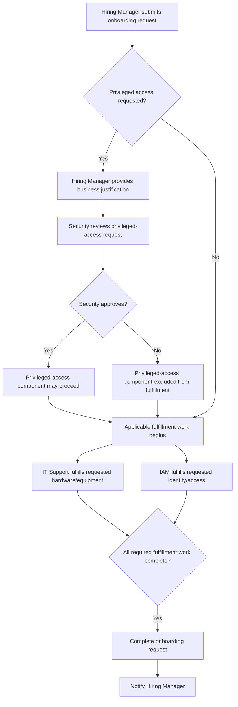

# Employee Access & Onboarding Process Flow

## Purpose

This document describes the sequence of activities, decision points, and fulfillment handoffs in the employee onboarding and access-request process, from initial request submission through completion.

## Actors

- Hiring Manager
- Security Approver
- IT Support
- IAM Analyst

## Process Flow

1. The Hiring Manager submits an employee onboarding request containing the required employee information and requested equipment and system access.

2. If privileged access is requested, the Hiring Manager provides a business justification.

3. Privileged access requested?
   - Yes: The request proceeds to Security review.
   - No: The request proceeds to fulfillment.

4. The Security Approver approves or rejects the privileged-access request.
   - Approved: The privileged-access component may proceed to fulfillment.
   - Rejected: The privileged-access component does not proceed to fulfillment.

5. Requested hardware and equipment work is assigned to IT Support for fulfillment.

6. Requested identity and access work is assigned to IAM for fulfillment.

7. IT Support and IAM complete their required fulfillment work.

8. Once all required fulfillment work is complete, the onboarding request is completed.

9. The Hiring Manager is notified that the onboarding request is complete.

## Process Diagram

## Alternate and Exception Paths

### No Privileged Access Requested

If the onboarding request does not include privileged access, Security review is not required and the request proceeds to the applicable fulfillment activities.

### Privileged Access Rejected

If the Security Approver rejects a privileged-access request, the rejected privileged-access component does not proceed to fulfillment. Other approved or non-privileged components of the onboarding request may continue through fulfillment.

### Technical Exceptions

Technical exception handling, including platform failures, assignment failures, and notification-delivery failures, is not defined for Version 1 of this process.

## Requirement Traceability

| Process Step | Related Requirement(s) | Relationship |
| --- | --- | --- |
| 1 | FR-001, FR-002, FR-003 | Request submission, employee-information capture, and equipment/access selection |
| 2 | FR-004 | Business justification for privileged access |
| 3–4 | FR-005, FR-008 | Security approval gate and rejection path |
| 5 | FR-006 | IT Support fulfillment routing |
| 6 | FR-007 | IAM fulfillment routing |
| 7–8 | FR-006, FR-007, FR-011 | Required fulfillment work proceeds to request completion |
| 9 | FR-009 | Completion notification to the Hiring Manager |
| Cross-cutting | FR-010 | Hiring Manager can view request status throughout the request lifecycle |
