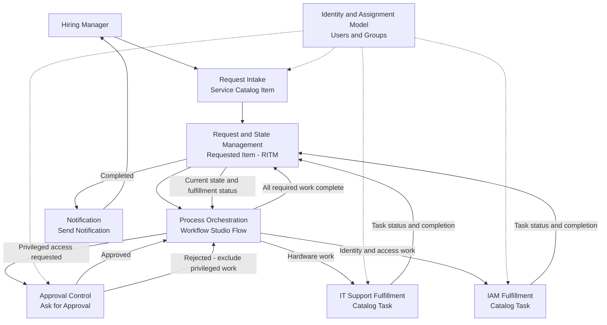

# Solution Architecture

## Purpose

This document defines the high-level technical structure of the Employee Access & Onboarding solution, including the major solution components, their responsibilities, and the interactions required to satisfy the documented business and functional requirements.

## Architectural Goals

- Prefer native ServiceNow capabilities over custom scripting when native functionality can reasonably satisfy the requirement.
- Keep approval responsibilities separate from fulfillment responsibilities.
- Maintain clear ownership of hardware, identity/access, and privileged-access activities across the responsible teams.
- Keep Version 1 self-contained within the ServiceNow Personal Developer Instance and avoid dependencies on production external systems.

## Logical Components

| Component | Purpose |
| --- | --- |
| Request Intake | Captures the onboarding request, employee information, equipment selections, access selections, and privileged-access justification. |
| Request and State Management | Maintains the overall onboarding request and its current lifecycle status through completion. |
| Process Orchestration | Coordinates the request path, approval gate, fulfillment activities, and completion conditions. |
| Approval Control | Manages privileged-access approval decisions and prevents unauthorized privileged fulfillment from proceeding. |
| IT Support Fulfillment | Represents and tracks hardware and equipment fulfillment work assigned to IT Support. |
| IAM Fulfillment | Represents and tracks identity and access fulfillment work assigned to IAM. |
| Notification | Communicates required request events, including completion, to the Hiring Manager. |
| Identity and Assignment Model | Represents the users, approvers, and fulfillment groups required for routing and ownership. |

## Component Responsibilities

| Component | Responsibilities | Related Requirement(s) |
| --- | --- | --- |
| Request Intake | Present the onboarding request, capture required employee information, capture equipment and access selections, and collect privileged-access justification when applicable. | FR-001, FR-002, FR-003, FR-004 |
| Request and State Management | Maintain the onboarding request as a persistent record, expose its current lifecycle status, and maintain its progression through completion. | FR-010, FR-011 |
| Process Orchestration | Coordinate conditional request paths, approval dependencies, fulfillment routing, and the determination that all required work is complete. | FR-005, FR-006, FR-007, FR-008, FR-011 |
| Approval Control | Record the Security approval decision and prevent privileged-access fulfillment unless approval is granted. | FR-005, FR-008, NFR-002 |
| IT Support Fulfillment | Represent, assign, and track applicable hardware and equipment fulfillment work. | FR-006 |
| IAM Fulfillment | Represent, assign, and track applicable identity and access fulfillment work. | FR-007 |
| Notification | Generate the required completion communication to the Hiring Manager. | FR-009 |
| Identity and Assignment Model | Represent the requesters, approvers, fulfillment personnel, and groups used to establish ownership and routing throughout the solution. | Supports FR-001, FR-005, FR-006, FR-007 |

## Data and Control Flow

### Data Flow

1. Request Intake captures the employee information, equipment selections, access selections, and any required privileged-access justification.

2. The captured request data is provided to Request and State Management, which maintains the persistent onboarding request and its current lifecycle state.

3. Process Orchestration evaluates the request data to determine which approval and fulfillment paths apply.

4. When privileged access is requested, the relevant request information is provided to Approval Control for Security review. The resulting approval decision, approver identity, and decision time are retained with the solution.

5. Applicable fulfillment information is provided to IT Support Fulfillment and IAM Fulfillment according to the requested equipment and access.

6. Fulfillment progress and completion information is returned to the solution so that the overall request state can be maintained.

7. When the onboarding request reaches completion, the request and requester information required for completion communication is provided to the Notification component.

### Control Flow

1. Submission of a valid onboarding request initiates process orchestration.

2. Process Orchestration determines whether privileged access is included.

3. If privileged access is requested, privileged fulfillment is held pending a Security approval decision.

4. An approved privileged-access decision allows the applicable privileged fulfillment path to proceed.

5. A rejected privileged-access decision prevents the rejected privileged-access component from proceeding while allowing unrelated valid fulfillment work to continue.

6. Applicable hardware and identity/access fulfillment activities may proceed independently.

7. Completion of all required fulfillment work allows the overall onboarding request to transition to a completed state.

8. Completion of the overall request initiates the required completion notification to the Hiring Manager.

## ServiceNow Implementation Mapping

| Logical Component | Planned ServiceNow Implementation | Notes |
| --- | --- | --- |
| Request Intake | Service Catalog catalog item with catalog variables | A catalog item will provide the Hiring Manager-facing onboarding form. Variables will capture employee information, equipment selections, access selections, and privileged-access justification. |
| Request and State Management | Requested Item record and catalog request lifecycle/stage information | The Requested Item will serve as the primary persistent record for the onboarding request and expose its progress through the request lifecycle. |
| Process Orchestration | Workflow Studio flow using a Service Catalog trigger | The flow will evaluate request data, control approval and fulfillment paths, coordinate completion conditions, and update request progression. |
| Approval Control | Workflow Studio Ask for Approval action and generated approval records | Security approval will control whether the privileged-access fulfillment path may proceed while retaining approval decision information. |
| IT Support Fulfillment | Catalog Task assigned to the IT Support group | Hardware and equipment work will be represented as fulfillment tasks associated with the requested item. |
| IAM Fulfillment | Catalog Task assigned to the IAM group | Identity and access work will be represented as fulfillment tasks associated with the requested item. |
| Notification | Workflow Studio Send Notification action with a ServiceNow Notification record | Completion of the overall request will trigger the configured completion notification to the Hiring Manager. |
| Identity and Assignment Model | ServiceNow users, groups, and group membership | Fictional Hiring Manager, Security, IT Support, and IAM identities/groups will provide request ownership, approval targets, and fulfillment assignment. |

## Architecture Diagram

Solid arrows represent request data, control decisions, or lifecycle updates between solution components. Dashed arrows represent supporting identity, group, and assignment relationships.

## Design Constraints and Decisions

### Design Constraints

* Version 1 will operate entirely within a ServiceNow Personal Developer Instance.
* Production Active Directory, Microsoft Entra ID, MID Server, REST API, HR-system, and production email integrations are outside the Version 1 architecture.
* Test users and organizational data will be fictional.
* Native ServiceNow capabilities will be preferred over custom scripting when they satisfy the documented requirements.

### Architecture Decisions

1. **Use the native Service Catalog request model for Version 1.**
   The solution will use a Service Catalog catalog item, Requested Item records, and Catalog Tasks rather than introducing custom request and fulfillment tables.

2. **Use Workflow Studio for process orchestration.**
   Native flow capabilities will coordinate conditional approval, fulfillment routing, completion evaluation, and notification.

3. **Keep privileged-access approval separate from access fulfillment.**
   Security will authorize or reject privileged access, while IAM will remain responsible for fulfillment.

4. **Use ServiceNow users and groups for assignment and approval modeling.**
   Fictional platform users and groups will represent the Hiring Manager, Security, IT Support, and IAM functions required by Version 1.

5. **Separate application-source-controlled artifacts from global Service Catalog configuration.**
   Scoped application artifacts that are suitable for ServiceNow source control will be versioned separately from Service Catalog configuration that exists in the global scope. The repository strategy for each artifact type will reflect the platform's deployment and source-control boundaries.

## Architecture Traceability

| Requirement | Architectural Home |
| --- | --- |
| FR-001 | Request Intake |
| FR-002 | Request Intake |
| FR-003 | Request Intake |
| FR-004 | Request Intake; Process Orchestration |
| FR-005 | Approval Control; Process Orchestration; IAM Fulfillment |
| FR-006 | Process Orchestration; IT Support Fulfillment; Identity and Assignment Model |
| FR-007 | Process Orchestration; IAM Fulfillment; Identity and Assignment Model |
| FR-008 | Approval Control; Process Orchestration; IAM Fulfillment |
| FR-009 | Notification; Process Orchestration |
| FR-010 | Request and State Management |
| FR-011 | Request and State Management; Process Orchestration |
| NFR-001 | Design Constraints; Identity and Assignment Model |
| NFR-002 | Approval Control; approval data flow |
| NFR-003 | Architectural Goals; Design Constraints; ADR-001 |

All documented functional and non-functional requirements have an identified architectural home. Implementation and testing will validate that each mapped component satisfies the associated requirement.
